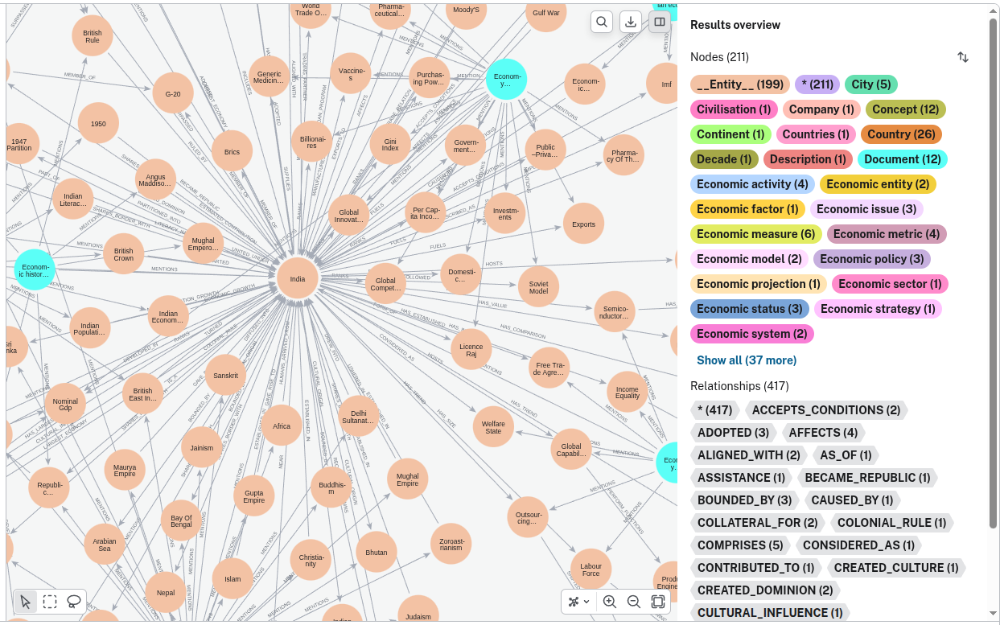

This repository demonstrates why Graph RAG is more effective than Naive RAG.

Follow the belo steps
1. Create venv
2. Install requirements.txt
3. For Naive RAG just execute the notebook naive_DataPrep.ipynb, All the queries and their respective responses are in the notebook only
4. For Graph RAG, we need follow the below steps
   a) Login to Ne04j and create a free tier instance, download the file that details of Ne04j URL, USERNAME, PASSWORD
   b) Create a.env file and paste all the contents of the downloaded file in to the .env file
   c) Run the file graph_DataPrep.py to create the knowledge graph inside your Ne04j instance
   d) Run the file graph_query.py by placing your own queries, answers can be seen in the terminal

For some reason, Code realted to Ne04j cannot be executed in jupyter notebook.

5. The files output.txt contains , a series of queries (experjmentations) and their responses.

About graph_DataPrep.py
a) In here I have chosen the topic "The story of Indian Economy" simply because of its complexity and popularity. 
b) In the main article I have chosen specific topics Economy of India, Economic history of India, 1991 Indian economic crisis, Economy of South Asia, Indian National Congress and Economy of the British Empire.
c) Using langchain modules, the article has been converted to graph data 

The knowledge graph in Ne04j looks like below, with nodes, relationships and property keys

